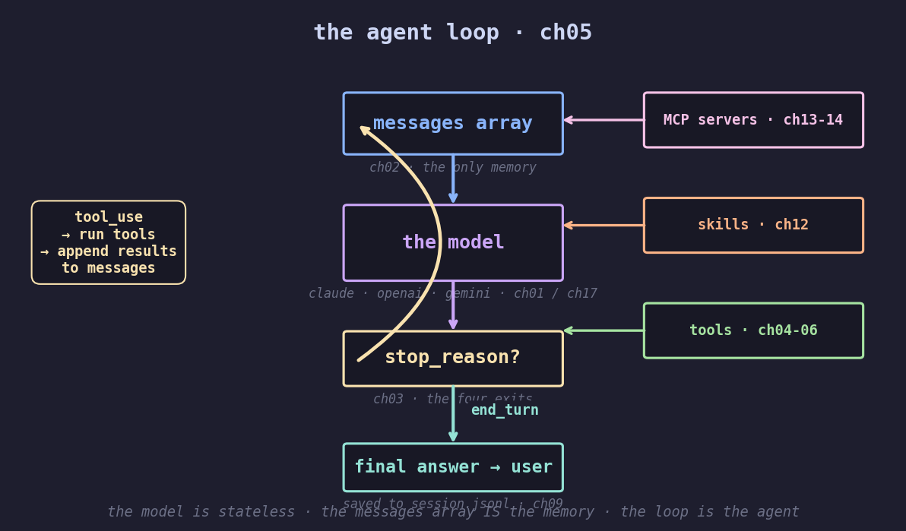

<p align="center">
  
</p>

# agent-zero-to-hero

> **A 7-week course in agent engineering.** Build a Claude-Code-shaped CLI agent from one HTTP call to a working website builder. 19 chapters. Zero frameworks.

<table>
<tr>
<td width="35%" valign="middle"></td>
<td valign="middle">

### Hi! I'm GuiGui 🐢 — your TA for this course.

We're going to build a Claude-Code-shaped agent harness *together* — from one HTTP request all the way to a CLI that ships real software. **No frameworks. No magic.** Every primitive in your favorite coding agent — sessions, compaction, MCP, skills, streaming — you'll write yourself.

**Pick a chapter and let's go.** ↓

</td>
</tr>
</table>

---

## 👀 Who this course is for

You'll get the most out of this course if you:

- Can write **basic Python** (loops, dicts, functions). No advanced async, types, or web frameworks needed.
- Have used a coding agent (Claude Code, Cursor, Devin) and wonder *what's actually happening inside*.
- Want to read the source of a real agent harness and **recognize every primitive by name**.
- Believe in *understanding* over *libraries* — every line is on screen, no `pip install agent-101`.

Not for you if you want a plug-and-play framework. Use [LangGraph](https://github.com/langchain-ai/langgraph) or [smolagents](https://github.com/huggingface/smolagents).

---

## 🗺️ The 7-week journey

<p align="center">
  
</p>

| Week | Theme | Chapters |
|---|---|---|
| <br>**Week 1** | **Foundations.** From one HTTP call to the agent loop. | [00](chapters/ch00_welcome.md) · [01](chapters/ch01_raw_call.md) · [02](chapters/ch02_messages_array.md) · [03](chapters/ch03_stop_reasons.md) · [04](chapters/ch04_one_tool.md) · **[05](chapters/ch05_the_loop.md)** |
| <br>**Week 2** | **Tool engineering.** Parallel calls, errors, system prompts. | [06](chapters/ch06_parallel_tools.md) · [07](chapters/ch07_errors.md) · [08](chapters/ch08_system_prompts.md) |
| <br>**Week 3** | **Cost & observability.** The dollar ticker. The 5× cache lever. Compaction. | [08b](chapters/ch08b_observability.md) · **[08c](chapters/ch08c_prompt_caching.md)** · **[10](chapters/ch10_compaction.md)** |
| <br>**Week 4** | **Persistence & scale.** Sessions on disk. Subagents. | [09](chapters/ch09_sessions.md) · **[11](chapters/ch11_subagents.md)** |
| <br>**Week 5** | **Skills & MCP.** Markdown loaded on demand. Three JSON-RPC calls. | [12](chapters/ch12_skills.md) · **[13](chapters/ch13_mcp_wire.md)** · [14](chapters/ch14_mcp_agent.md) |
| <br>**Week 6** | **Engineering polish.** Streaming. Three providers, one loop. | [15](chapters/ch15_streaming_text.md) · [16](chapters/ch16_streaming_tools.md) · [17](chapters/ch17_multi_provider.md) |
| <br>**Week 7** | **Capstone.** Read [`agent.py`](agent.py). Run [`microsite/`](microsite/). Build something. | [agent.py](agent.py) · [microsite](microsite/) |

> **Bold chapters** are the load-bearing concepts — read them twice.
> Full schedule with problem sets, labs, and the final exam: **[SYLLABUS.md](SYLLABUS.md)**.

---

## 📅 How to take this course

| | Pace | Time / week | Total |
|---|---|---|---|
| 🎓 **Full course** | One week per module + capstone | ~3-4 hrs | ~25 hrs |
| ⚡ **Speedrun** | Skip homework, run [speedrun.sh](runs/speedrun.sh) | — | ~5 hrs |
| 🛠️ **Reference** | Read [`agent.py`](agent.py) cover-to-cover, dip into chapters as needed | — | ~2 hrs |

**API spend:** about **$0.50** for the speedrun, **$5–$10** for the full course (the capstone is the most expensive turn).

You can verify the install **without an API key** — `pytest tests/` runs against mocked LLMs and a real MCP subprocess.

---

## ⚡ Quick start

```bash
git clone https://github.com/KeWang0622/agent-zero-to-hero.git
cd agent-zero-to-hero
pip install -e .

export ANTHROPIC_API_KEY=sk-ant-...
python -m chapters.ch00_welcome "what is 17 * 23?"     # your first agent

# the climax: a Claude-Code-shaped CLI you understand line by line
python agent.py "build me Tetris in one HTML file and open it"

# the capstone: the agent you wrote ships a real website
python microsite/build_site.py "a Brooklyn ramen shop called Sazae"
```

---

## 🎬 The agent loop

<p align="center">
  
</p>

This is the entire shape of every coding agent. The model is stateless; the messages array is the only memory. Tools, skills, sessions, MCP — they're how the **harness** extends the model. They're not the agent. **The loop is.**

```python
# the entire agent loop. six lines. no abstractions.
while True:
    r = client.messages.create(model=M, messages=msgs, tools=TOOLS)
    msgs.append({"role": "assistant", "content": r.content})
    if r.stop_reason != "tool_use":
        return r
    msgs.append({"role": "user", "content": run_all_tools(r.content)})
```

By the end of [chapter 5](chapters/ch05_the_loop.md) you'll write this from memory.

---

## 🐢 Quotable mottos — one per hero chapter

| Chapter | Motto |
|---|---|
| [02 messages](chapters/ch02_messages_array.md) | *"The messages array IS the memory. There is no other memory."* |
| [05 the_loop](chapters/ch05_the_loop.md) | *"An agent loop is just `while True` of one talking to the other."* |
| [08c caching](chapters/ch08c_prompt_caching.md) | *"It's not a feature. It's a placement problem."* |
| [10 compaction](chapters/ch10_compaction.md) | *"Surgery, not GC. Replace the older half with one synthetic message."* |
| [11 subagents](chapters/ch11_subagents.md) | *"Context isolation as a feature. 10× cheaper."* |
| [13 mcp_wire](chapters/ch13_mcp_wire.md) | *"Three method calls. JSON-RPC over stdio. That's all."* |

---

## 📂 Repo layout

```
chapters/        19 numbered Python files + matching .md walkthroughs
agent.py         the climax — Claude-Code-shaped CLI built from chapter primitives
microsite/       capstone — build a website from one prompt
skills/          example SKILL.md files (haiku-master, landing-page)
mcp_servers/     example MCP servers (calculator)
tests/           verify your install, no API key required
docs/            ADAPTING.md (port to OpenAI/Gemini), FAQ.md
SYLLABUS.md      7-week schedule with problem sets and exam
AGENT.md         project context auto-loaded by agent.py
```

---

## 🎓 For instructors

This course is MIT-licensed and built to be adopted. If you teach at a university, bootcamp, or run a study group:

- All chapters are runnable in 30 seconds.
- 25 students × 7 weeks ≈ $50 in API spend.
- See [SYLLABUS.md](SYLLABUS.md) for problem sets, labs, and final exam.

[Open an issue](https://github.com/KeWang0622/agent-zero-to-hero/issues) if you adopt this for a class — we'll add your school here.

---

## 🙏 Acknowledgements

- [@karpathy](https://github.com/karpathy) for the literary genre of educational repos (`nanoGPT`, `nanochat`, `micrograd`).
- [Anthropic](https://anthropic.com) for shipping the cleanest tool-use protocol of any major LLM provider.
- [Simon Willison](https://simonwillison.net) — *"Claude Skills are maybe a bigger deal than MCP"* inspired chapter 12.

## License

MIT. See [LICENSE](LICENSE).
