<p align="center">
  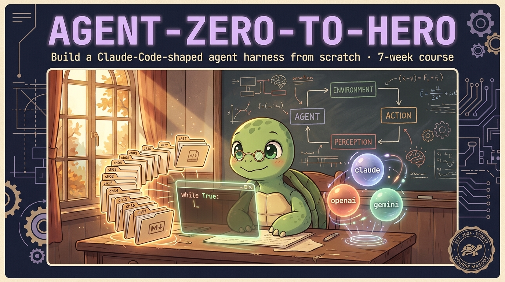
</p>

# Build Claude Code in 4,500 lines of Python.

> 19 chapters · the entire agent loop in 6 lines · 3 providers · 42 tests pass without an API key · `$0.50` speedrun · zero frameworks.

<p align="center">
  <a href="LICENSE"></a>
  <a href="https://github.com/KeWang0622/agent-zero-to-hero/actions"></a>
  
  
  
  <a href="https://github.com/KeWang0622/agent-zero-to-hero/stargazers"></a>
</p>

<p align="center">
  <a href="https://github.com/KeWang0622/agent-zero-to-hero/raw/main/assets/explainer.mp4">
    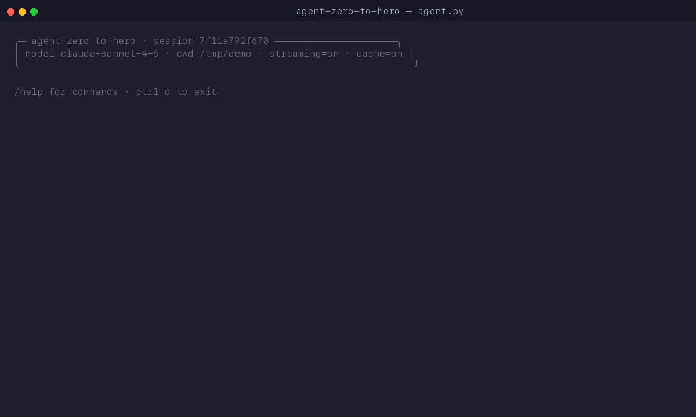
  </a>
</p>

> 📺 **75-second narrated walkthrough**: [`assets/explainer.mp4`](assets/explainer.mp4) (click the GIF or open directly).

## ⚡ Run it in 30 seconds (no API key)

```bash
git clone https://github.com/KeWang0622/agent-zero-to-hero.git
cd agent-zero-to-hero && pip install -e .
pytest tests/                                          # 42 passed in 0.6s
```

To run the actual agent:

```bash
export ANTHROPIC_API_KEY=sk-ant-...
python -m chapters.ch00_welcome "what is 17 * 23?"     # your first agent
python agent.py "build me Tetris in one HTML file"     # the climax
python microsite/build_site.py "Brooklyn ramen shop"   # the capstone
```

## 🎯 The entire agent loop is 6 lines

```python
while True:
    r = client.messages.create(model=M, messages=msgs, tools=TOOLS)
    msgs.append({"role": "assistant", "content": r.content})
    if r.stop_reason != "tool_use":
        return r
    msgs.append({"role": "user", "content": run_all_tools(r.content)})
```

That's Claude Code. That's Cursor. That's Devin. Every coding agent on Earth wraps these six lines. By the end of [chapter 5](chapters/ch05_the_loop.md) you'll write this from memory.

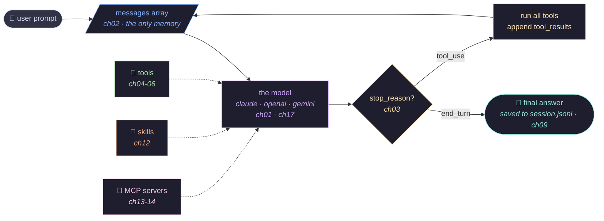

The model is stateless. The messages array is the only memory. Tools, skills, sessions, MCP — they're how the **harness** extends the model. They're not the agent. **The loop is.**

## 👀 Who this is for

You'll get the most out of it if you:

- Can write **basic Python** (loops, dicts, functions). No advanced async, types, or web frameworks needed.
- Have used a coding agent (Claude Code, Cursor, Devin) and wonder *what's actually happening inside*.
- Want to read the source of a real agent harness and **recognize every primitive by name**.

Not for you if you want a plug-and-play framework. Use [LangGraph](https://github.com/langchain-ai/langgraph) or [smolagents](https://github.com/huggingface/smolagents).

## 📑 The 19 chapters

Each chapter is one Python file + a matching learning page (`chapters/chNN_topic.py` + `.md`). Read the `.md`, run the `.py`, do the homework.

| # | Chapter | What you'll learn |
|---|---|---|
| 00 | [welcome](chapters/ch00_welcome.md) | A complete working agent in 30 lines. The whole shape, in 5 minutes. |
| 01 | [raw_call](chapters/ch01_raw_call.md) | One HTTP POST. The Messages API. No SDK. |
| 02 | [messages_array](chapters/ch02_messages_array.md) | The API is stateless. The `messages` array IS the memory. |
| 03 | [stop_reasons](chapters/ch03_stop_reasons.md) | The seven ways out of the loop. Handle each correctly. |
| 04 | [one_tool](chapters/ch04_one_tool.md) | The `tool_use` → `tool_result` protocol. One round-trip. |
| **05** | **[the_loop](chapters/ch05_the_loop.md)** | **THE LOOP.** Six lines. Decomposition, ReAct, planning. The pivot chapter. |
| 06 | [parallel_tools](chapters/ch06_parallel_tools.md) | Multiple tool_use blocks in one turn. The single-user-message rule. |
| 07 | [errors](chapters/ch07_errors.md) | Tool errors as content. `is_error: true`. Refusals. |
| 08 | [system_prompts](chapters/ch08_system_prompts.md) | What goes in `system` vs `messages`. Persona that survives compaction. |
| 08b | [observability](chapters/ch08b_observability.md) | The dollar ticker. `response.usage` × prices = no bill shock. |
| **08c** | **[prompt_caching](chapters/ch08c_prompt_caching.md)** | **The 5× cost lever.** Per-model thresholds, breakpoints, TTL, foot-guns. |
| 09 | [sessions](chapters/ch09_sessions.md) | JSONL on disk. Resume after `Ctrl-C`. |
| **10** | **[compaction](chapters/ch10_compaction.md)** | **The chapter that pays for itself.** Surgery, not GC. |
| 11 | [subagents](chapters/ch11_subagents.md) | Context isolation as a feature. 10× cheaper. |
| 12 | [skills](chapters/ch12_skills.md) | Markdown loaded on demand. Progressive disclosure. |
| **13** | **[mcp_wire](chapters/ch13_mcp_wire.md)** | **MCP demystified** — JSON-RPC over stdio with three method calls. |
| 14 | [mcp_agent](chapters/ch14_mcp_agent.md) | Wire your own MCP server into the agent loop. |
| 15 | [streaming_text](chapters/ch15_streaming_text.md) | SSE basics. Render text deltas as they arrive. |
| 16 | [streaming_tools](chapters/ch16_streaming_tools.md) | `input_json_delta` accumulation. The hard chapter. |
| 17 | [multi_provider](chapters/ch17_multi_provider.md) | Same loop, three wires (Anthropic / OpenAI / Gemini). |
| ★ | **[agent.py](agent.py)** | The climax. ~840-line Claude-Code-shaped CLI built from chapter primitives. |
| ★ | **[microsite/](microsite/)** | The capstone. Build a working website from one prompt. |

Every chapter ends with **Summary**, **Homework**, and **References** (papers + docs + reference repos).

## 🗺️ The 7-week journey

<p align="center">
  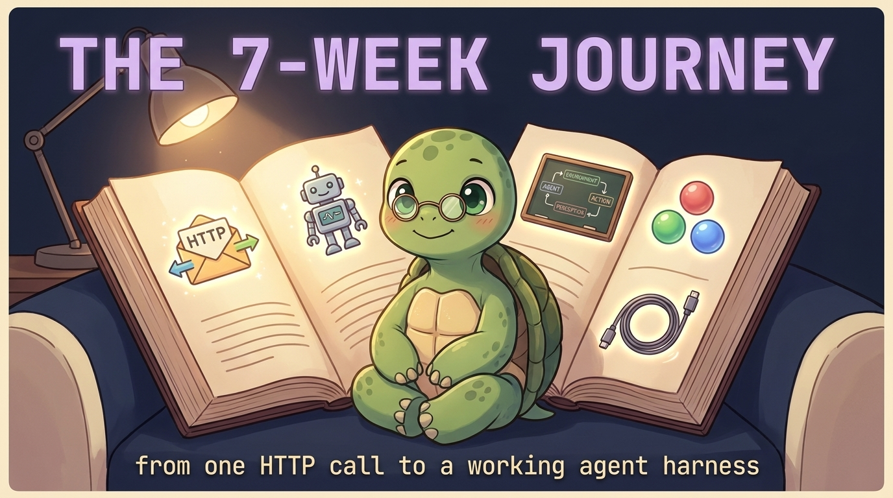
</p>

| Week | Theme | Chapters |
|---|---|---|
| 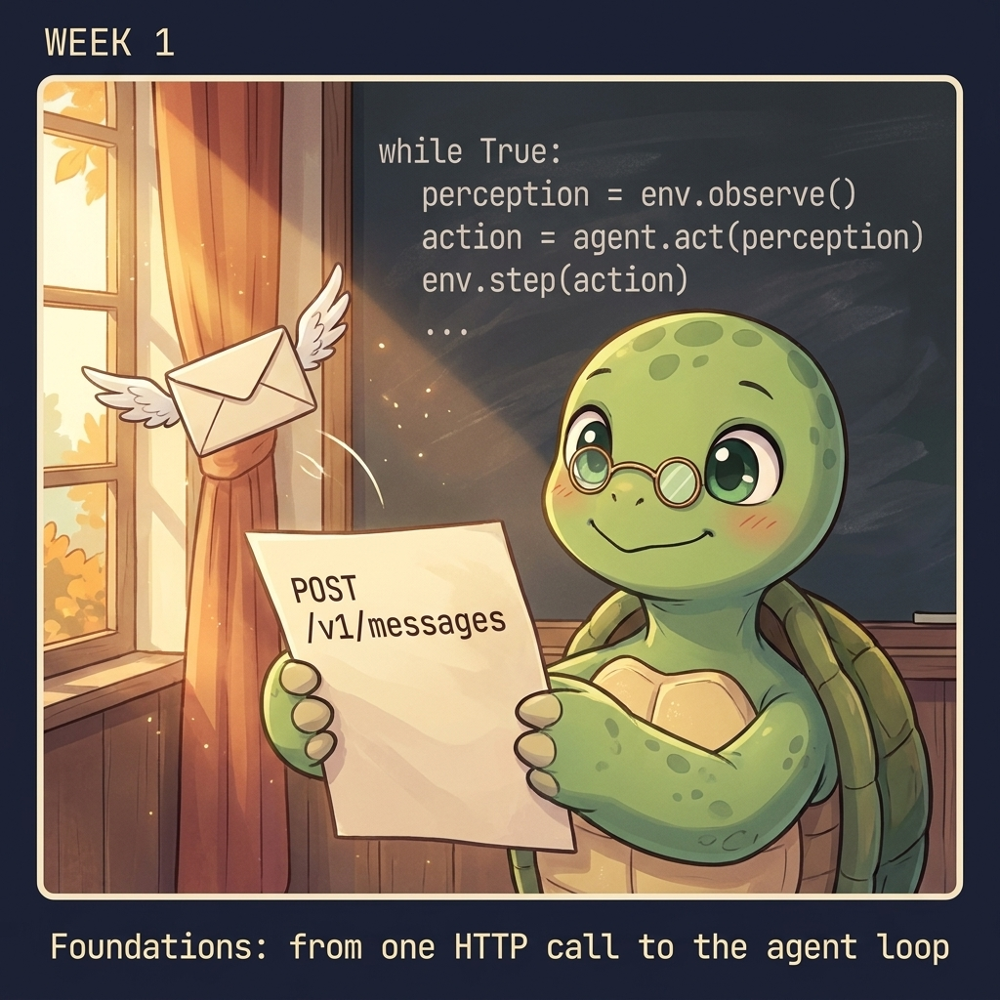<br>**Week 1** | **Foundations.** From one HTTP call to the agent loop. | [00](chapters/ch00_welcome.md) · [01](chapters/ch01_raw_call.md) · [02](chapters/ch02_messages_array.md) · [03](chapters/ch03_stop_reasons.md) · [04](chapters/ch04_one_tool.md) · **[05](chapters/ch05_the_loop.md)** |
| 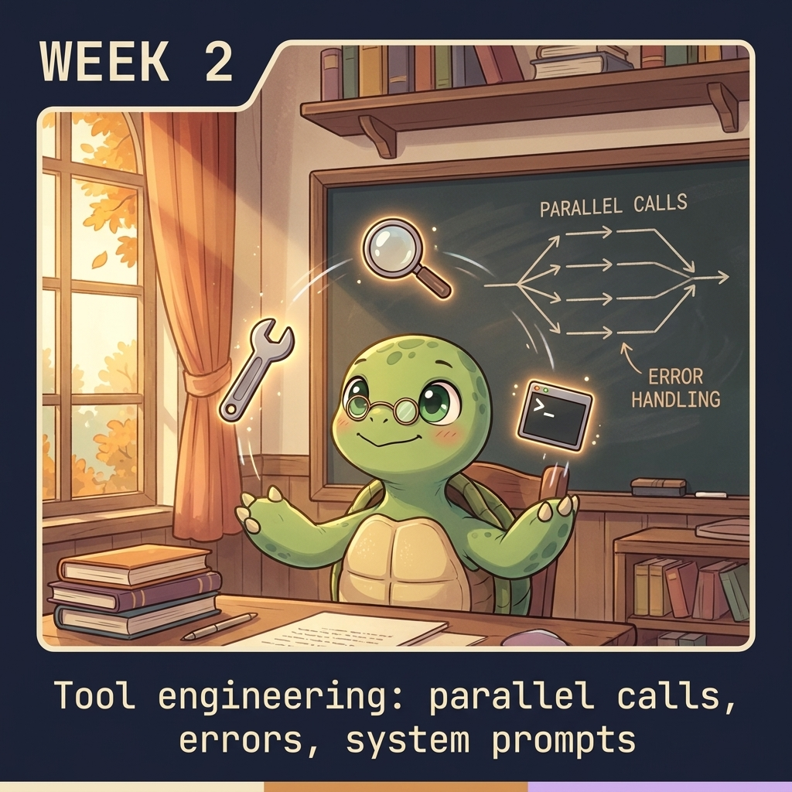<br>**Week 2** | **Tool engineering.** Parallel calls, errors, system prompts. | [06](chapters/ch06_parallel_tools.md) · [07](chapters/ch07_errors.md) · [08](chapters/ch08_system_prompts.md) |
| 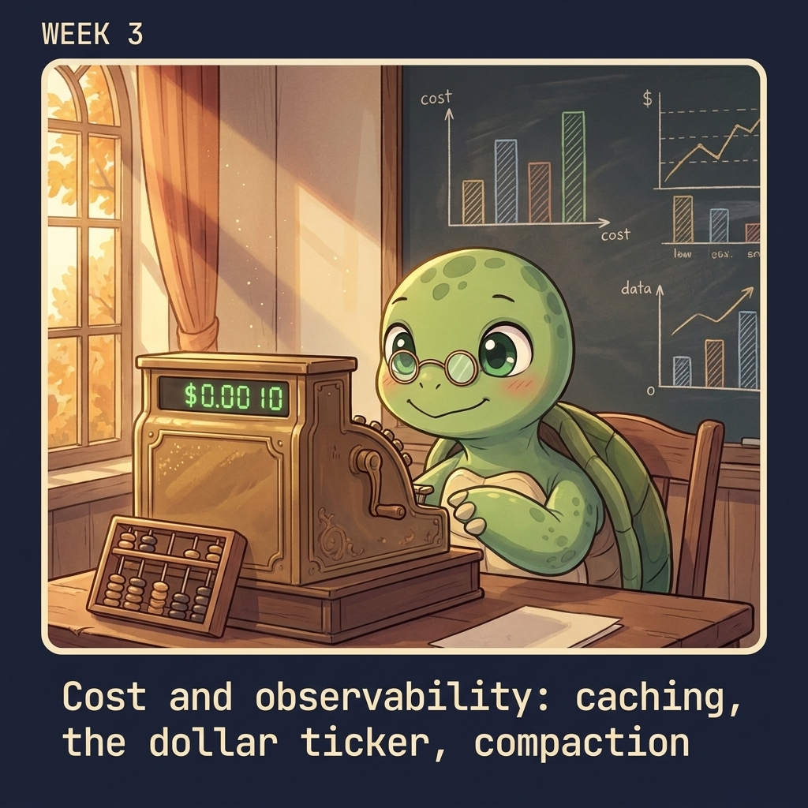<br>**Week 3** | **Cost & observability.** The dollar ticker. The 5× cache lever. Compaction. | [08b](chapters/ch08b_observability.md) · **[08c](chapters/ch08c_prompt_caching.md)** · **[10](chapters/ch10_compaction.md)** |
| 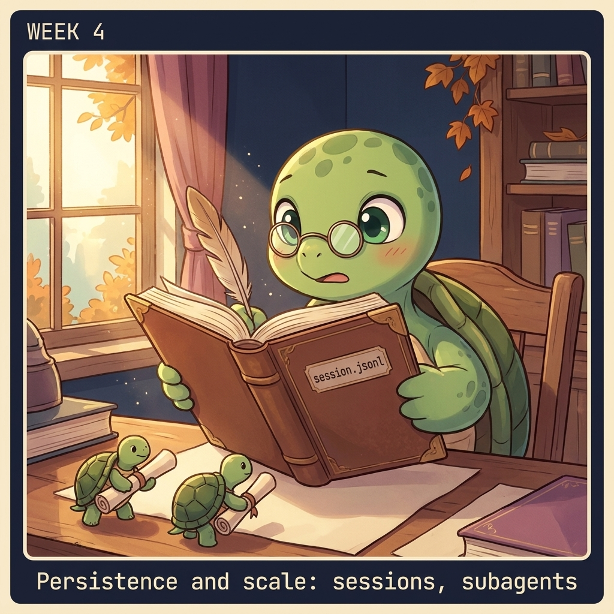<br>**Week 4** | **Persistence & scale.** Sessions on disk. Subagents. | [09](chapters/ch09_sessions.md) · **[11](chapters/ch11_subagents.md)** |
| 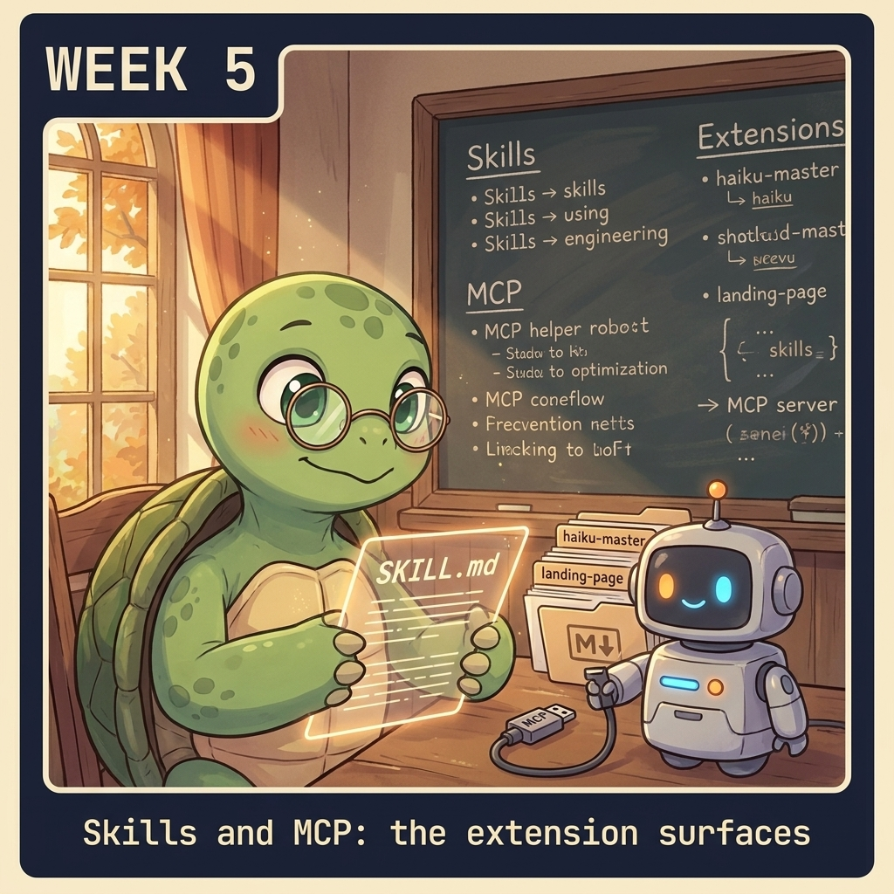<br>**Week 5** | **Skills & MCP.** Markdown loaded on demand. Three JSON-RPC calls. | [12](chapters/ch12_skills.md) · **[13](chapters/ch13_mcp_wire.md)** · [14](chapters/ch14_mcp_agent.md) |
| 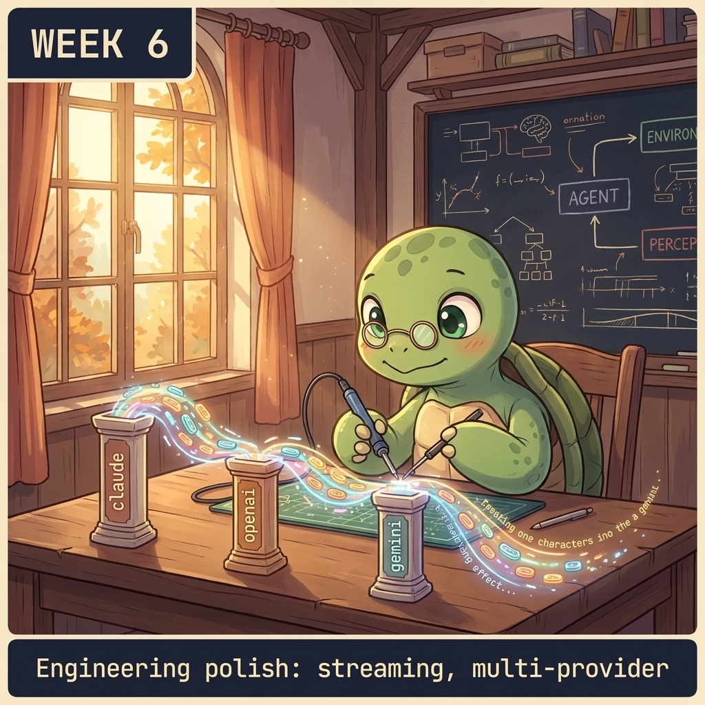<br>**Week 6** | **Engineering polish.** Streaming. Three providers, one loop. | [15](chapters/ch15_streaming_text.md) · [16](chapters/ch16_streaming_tools.md) · [17](chapters/ch17_multi_provider.md) |
| 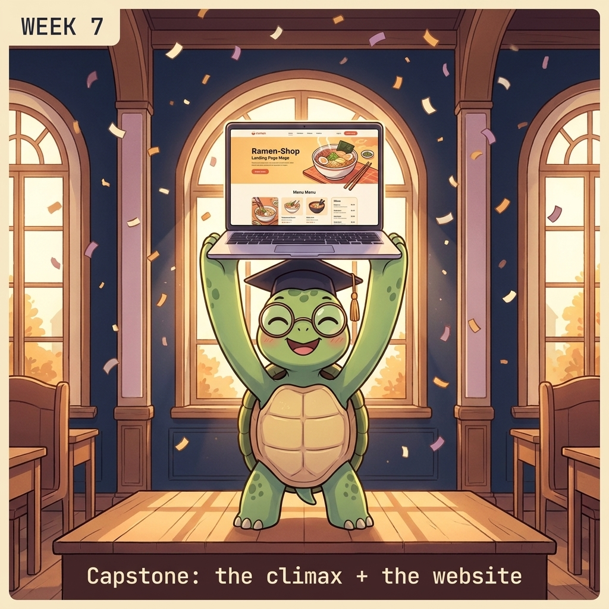<br>**Week 7** | **Capstone.** Read [`agent.py`](agent.py). Run [`microsite/`](microsite/). Build something. | [agent.py](agent.py) · [microsite](microsite/) |

> **Bold chapters** are load-bearing concepts — read them twice.
> Full schedule with problem sets, labs, and the final exam: **[SYLLABUS.md](SYLLABUS.md)**.

## 📅 How to take it

| | Pace | Time / week | Total |
|---|---|---|---|
| 🎓 **Full course** | One week per module + capstone | ~3-4 hrs | ~25 hrs |
| ⚡ **Speedrun** | Skip homework, run [speedrun.sh](runs/speedrun.sh) | — | ~5 hrs |
| 🛠️ **Reference** | Read [`agent.py`](agent.py) cover-to-cover, dip into chapters as needed | — | ~2 hrs |

**API spend:** about **$0.50** for the speedrun, **$5–$10** for the full course (the capstone is the most expensive turn). You can verify the install **without an API key** — `pytest tests/` runs against mocked LLMs and a real MCP subprocess.

## 🐢 Quotable mottos

| Chapter | Motto |
|---|---|
| [02 messages](chapters/ch02_messages_array.md) | *"The messages array IS the memory. There is no other memory."* |
| [05 the_loop](chapters/ch05_the_loop.md) | *"An agent loop is just `while True` of one talking to the other."* |
| [08c caching](chapters/ch08c_prompt_caching.md) | *"It's not a feature. It's a placement problem."* |
| [10 compaction](chapters/ch10_compaction.md) | *"Surgery, not GC. Replace the older half with one synthetic message."* |
| [11 subagents](chapters/ch11_subagents.md) | *"Context isolation as a feature. 10× cheaper."* |
| [13 mcp_wire](chapters/ch13_mcp_wire.md) | *"Three method calls. JSON-RPC over stdio. That's all."* |

---

<table>
<tr>
<td width="32%" valign="top">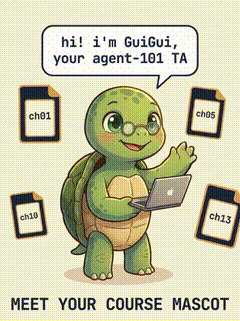</td>
<td valign="top">

### Hi! I'm GuiGui 🐢

I'm the mascot for this course. The chapters are written in plain prose; I show up in the illustrations to keep the energy up. If you spot me with a graduation cap, you've reached week 7.

</td>
</tr>
</table>

## 📂 Repo layout

```
chapters/        19 numbered Python files + matching .md walkthroughs
agent.py         the climax — Claude-Code-shaped CLI built from chapter primitives
microsite/       capstone — build a website from one prompt
skills/          example SKILL.md files (haiku-master, landing-page)
mcp_servers/     example MCP servers (calculator)
tests/           verify your install, no API key required
docs/            ADAPTING.md (port to OpenAI/Gemini), FAQ.md
SYLLABUS.md      7-week schedule with problem sets and exam
AGENT.md         project context auto-loaded by agent.py
```

## 🎓 For instructors

This course is MIT-licensed and built to be adopted. All chapters are runnable in 30 seconds. 25 students × 7 weeks ≈ $50 in total API spend. See [SYLLABUS.md](SYLLABUS.md) for problem sets, labs, and final exam. [Open an issue](https://github.com/KeWang0622/agent-zero-to-hero/issues) if you adopt this for a class — we'll add your school here.

## 📈 Star history

[](https://star-history.com/#KeWang0622/agent-zero-to-hero&Date)

## 🙏 Acknowledgements

- [@karpathy](https://github.com/karpathy) for the literary genre of educational repos (`nanoGPT`, `nanochat`, `micrograd`).
- [Anthropic](https://anthropic.com) for shipping the cleanest tool-use protocol of any major LLM provider.
- [Simon Willison](https://simonwillison.net) — *"Claude Skills are maybe a bigger deal than MCP"* inspired chapter 12.

Written by **[Ke Wang](https://github.com/KeWang0622)** — agent identity & memory at [Pika](https://pika.art). Previously: Samsung, Adobe (Marc Levoy's team). PhD in computational imaging.

## License

MIT. See [LICENSE](LICENSE).
