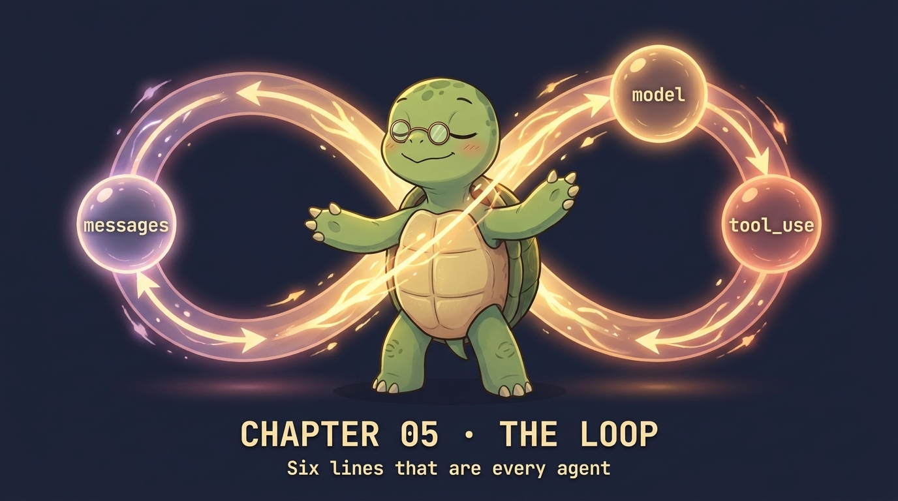

# Chapter 05 — THE LOOP 🐢

<p align="center">
  
</p>

> **The thing the model can't do is run code. The thing you can't do is think. An agent loop is just `while True` of one talking to the other.**

## 🐢 GuiGui says

This is the chapter the entire course pivots on. Everything before it built up to one insight. Everything after it adds layers around it. The loop itself is six lines. Read them slowly. **By the end of this chapter you can write Cursor / Claude Code / Devin from a blank file.**

## The idea

```
                    ┌─────── messages ───────┐
                    ▼                         │
                ┌─────────┐                   │
   user input → │  model  │ → tool_use blocks │
                └─────────┘                   │
                    │                         │
                    ▼                         │
                run all tools ────tool_results┘
```

Two-character protocol. Forever. Every framework on Earth wraps these six lines.

## Show me the code

```python
def agent_loop(prompt):
    msgs = [{"role": "user", "content": prompt}]
    for turn in range(MAX_TURNS):                       # always cap iterations
        r = client.messages.create(model=M, tools=TOOLS, messages=msgs, max_tokens=2048)
        msgs.append({"role": "assistant", "content": r.content})
        if r.stop_reason != "tool_use":
            return r
        msgs.append({"role": "user", "content": [
            {"type": "tool_result", "tool_use_id": b.id, "content": dispatch(b.name, b.input)}
            for b in r.content if b.type == "tool_use"
        ]})
    raise RuntimeError("hit MAX_TURNS")
```

That's it. That's the loop. Everything else in this repo is layers around it.

## ⚠️ Watch out for

**The runaway loop.** Without a cap, a buggy tool that returns "try again" can cost you $40 in an hour. Always `for turn in range(MAX_TURNS)`, never bare `while True`.

## ✅ Summary

- Agent = `while True { call → dispatch → continue }`. Six lines.
- The model is stateless; you carry state. The model can't run code; you can.
- A turn cap is non-negotiable.

## 📝 Homework

```bash
python -m chapters.ch05_the_loop "what's the biggest python file in chapters/?"
```

1. Count how many turns the agent takes. Should be 2-4.
2. Set `MAX_TURNS=2` and run a complex task. Document the failure mode in 2 sentences.
3. Add `print(f"turn {turn}: msgs.len={len(msgs)}")` inside the loop. Watch the array grow.
4. **Synthesis (write 100 words):** What's the smallest thing that turns this loop from "tutorial" into "production"?

## Where this shows up in agent.py

`agent.py:541-617` — same six lines, plus streaming, plus retries, plus permissions, plus session writes. Read the production version side by side.

## 🚀 Next

[Chapter 06 — Parallel tools](ch06_parallel_tools.md): claude can ask for three things at once. The single-user-message rule.
