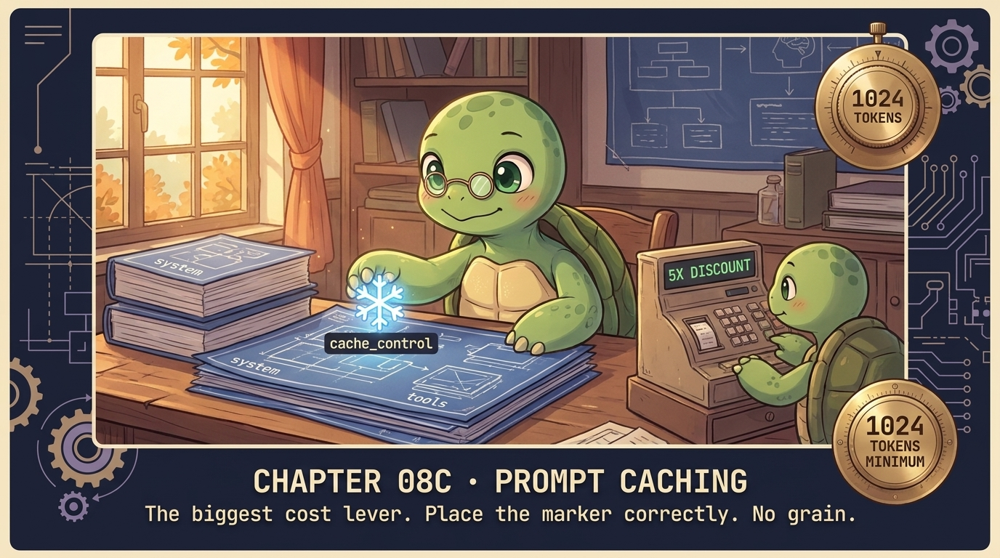

# Chapter 08c — Prompt Caching, Deep 🐢

<p align="center">
  
</p>

> **Caching is the single biggest cost lever for agents. Get it right: 5× cheaper. Get it wrong: pay the cache *write* price every turn AND never read.**

## 🐢 GuiGui says

This isn't a feature you "turn on." It's a placement problem: WHERE do you put `cache_control`? Three rules and you're set. Skip them and caching is silently a no-op.

## The 3 rules

**Rule 1 — The threshold (varies by model).** Below the minimum, `cache_control` is silently ignored. `cache_read` stays 0.

| Model | Minimum cacheable input |
|---|---|
| Sonnet 4.5 / 4 / 3.7 | 1,024 tokens |
| Sonnet 4.6 | 2,048 tokens |
| Opus 4.5 / 4.6 / 4.7 | **4,096 tokens** |
| Haiku 4.5 | **4,096 tokens** |
| Haiku 3.5 | 2,048 tokens |

A common bug: assume "Sonnet/Opus = 1024" and silently get full input billing on Opus 4.6.

**Rule 2 — The breakpoints.** Up to **4** `cache_control` markers per request. Each marks the END of a cacheable prefix. Order: cache things that change LEAST (system → tools → AGENT.md → messages).

**Rule 3 — The TTL.** Default = 5 min. Daemons: `{"type": "ephemeral", "ttl": "1h"}`.

| TTL | Write cost | Break-even (vs uncached) |
|---|---|---|
| 5 min | 1.25× input | **1 cache read** |
| 1 hour | 2× input | **2 cache reads** |
| Reads | 0.1× input | — |

> Anthropic's pricing page: *"caching pays off after just one cache read for the 5-minute duration, or after two cache reads for the 1-hour duration."*
> Use 1-hour when reuse spans multiple 5-minute windows.

## Show me the code

```python
# cache the system prompt + the entire tools list
system = [{"type": "text", "text": SYSTEM,
           "cache_control": {"type": "ephemeral"}}]

# put cache_control on the LAST tool — caches everything up to it
tools = [*TOOLS_LIST[:-1],
         {**TOOLS_LIST[-1], "cache_control": {"type": "ephemeral"}}]

r = client.messages.create(model=M, system=system, tools=tools,
                           messages=msgs, max_tokens=1024)
```

## Cache by demonstration (real measured data)

```
run 1, no cache:    $0.0055   in=1589   cw=0      cr=0
run 2, no cache:    $0.0052   in=1589   cw=0      cr=0
run 3, cache write: $0.0065   in=13     cw=1576   cr=0     ← writes
run 4, rewrites:    $0.0072   in=13     cw=1576   cr=0
run 5, full read:   $0.0010   in=13     cw=0      cr=1576  ← 5× cheaper
```

## ⚠️ Watch out for

**Cache poisoning.** Embedding `datetime.now()` in your system prompt → cache miss every turn → you pay the write price (1.25×) AND never read. Cache the stable prefix. Vary the tail.

**Threshold mismatch.** Code that worked on Sonnet 4.5 (1,024 threshold) silently no-ops on Opus 4.6 (4,096 threshold). Always verify `cache_read_input_tokens > 0` after deploying.

## ✅ Summary

- Below your model's threshold, caching is silent no-op (varies 1,024 – 4,096).
- `cache_control` marks the END of the cacheable prefix.
- 5× cost reduction is real and measured. Run 5 vs run 1.
- Up to 4 breakpoints per request.

## 📝 Homework

```bash
python -m chapters.ch08c_prompt_caching
```

1. Watch run 5 vs run 1. Confirm the 5× delta.
2. Make the system prompt 500 tokens (below threshold). Confirm `cache_read` stays 0.
3. Compute break-even arithmetic: at what call count does 1-hour TTL beat 5-minute, given reuse every 8 minutes?
4. **Find the bug:** in `agent.py`, what's the threshold for the default model? Verify the system prompt clears it after AGENT.md loads.

## 📚 References

- [Anthropic — Prompt caching](https://docs.anthropic.com/en/docs/build-with-claude/prompt-caching) — the canonical reference (read this twice)
- [Anthropic — Cache breakpoints](https://docs.anthropic.com/en/docs/build-with-claude/prompt-caching#cache-breakpoints) — the 4-marker constraint
- [Anthropic — Extended (1-hour) cache](https://docs.anthropic.com/en/docs/build-with-claude/prompt-caching#1-hour-cache-duration) — the daemon TTL
- [Pricing page — caching costs](https://www.anthropic.com/pricing) — current write/read multipliers

## 🚀 Next

[Chapter 09 — Sessions](ch09_sessions.md): a conversation that survives `Ctrl-C`.
