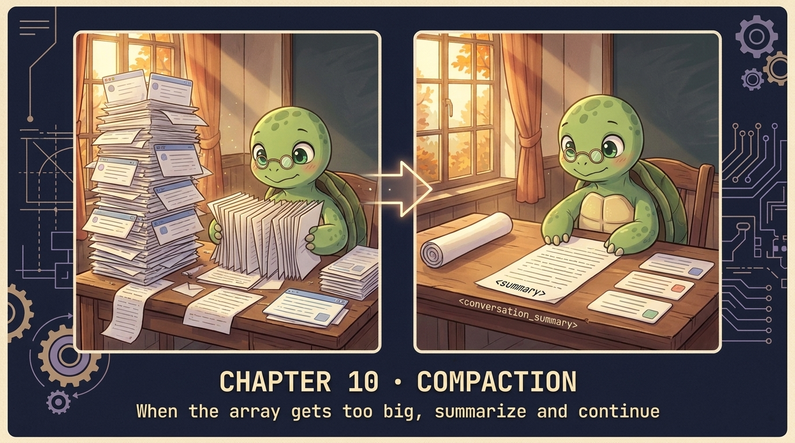

# Chapter 10 — Compaction 🐢

<p align="center">
  
</p>

> **When the messages array gets too big, Claude gets dumber AND more expensive. Compaction is one LLM call that summarizes old turns and lets you keep going.**

## 🐢 GuiGui says

Every Claude Code user has watched *"Compacting…"* appear and wondered. This is the chapter that demystifies it. ~80 lines. **The chapter that pays for itself in week one of any production deployment.**

## The idea

```
BEFORE  [m1, m2, m3, m4, m5, m6, m7, m8, m9, m10]   ← 60% of context window
                       │
              summarize via 1 LLM call
                       ▼
AFTER   [<summary>, m7, m8, m9, m10]                ← back under threshold
        ↑              ↑
        synthetic     verbatim recent
```

Four design choices:
1. **Trigger** — token count, not message count. Fire at 60% of window.
2. **What to summarize** — oldest N. Recent ones still load-bearing.
3. **Preserve verbatim** — file paths, UUIDs, decisions, pending TODOs.
4. **Drop** — retried errors, idle exploration, redundant tool output.

## Show me the code

```python
def compact(messages, keep_recent=4):
    if len(messages) <= keep_recent + 1:
        return messages

    old, recent = messages[:-keep_recent], messages[-keep_recent:]

    r = client.messages.create(
        model=M, system=SUMMARIZER_PROMPT, max_tokens=2048,
        messages=old + [{"role": "user", "content": "Summarize per instructions."}],
    )
    summary = "".join(b.text for b in r.content if b.type == "text")

    preamble = (f"<conversation_summary>\n{summary}\n</conversation_summary>")
    return [{"role": "user", "content": preamble}] + recent
```

That's the surgery. One LLM call. Replace the older half. Resume the loop.

## ⚠️ Watch out for

**The orphan tool_use.** Summarizing a slice that ENDS on an assistant tool_use breaks the API (the matching tool_result is now in the discarded part). Fix: walk back until the older slice ends on a safe message.

## ✅ Summary

- Trigger at 60% of context window, not message count.
- Replace older half with one synthetic user message ("conversation_summary").
- Preserve identifiers verbatim. Drop redundancy.

## 📝 Homework

```bash
python -m chapters.ch10_compaction       # forces compaction by stuffing context
```

1. Run the stress test. Compare before/after token counts.
2. Lower `KEEP_RECENT` to 1. Run a multi-step task. What gets lost?
3. Edit `SUMMARIZER_PROMPT` to drop the "preserve identifiers" line. Watch UUIDs go missing.

## Where this shows up in agent.py

`agent.py:421-448` — including the tool_use boundary fix that the API rejected without.

## 🚀 Next

[Chapter 11 — Subagents](ch11_subagents.md): another way to keep context small — never put it there in the first place.
