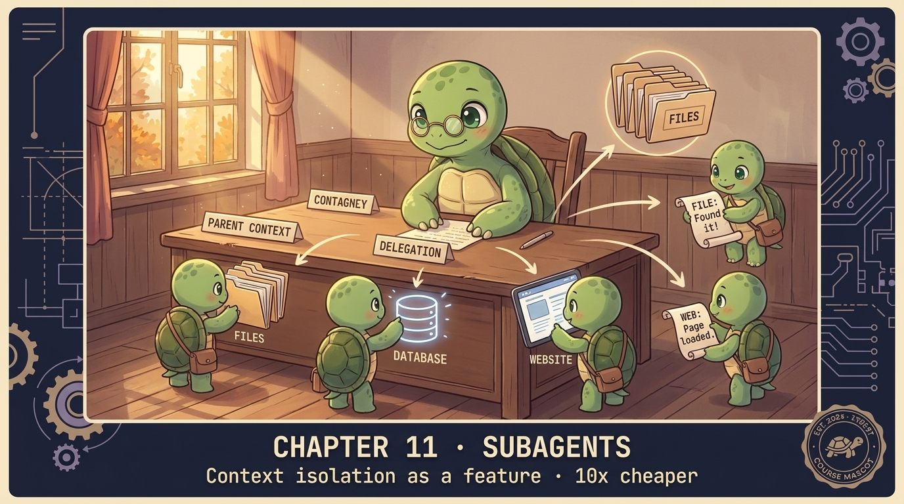

# Chapter 11 — Subagents 🐢

<p align="center">
  
</p>

> **A subagent is an agent loop with a FRESH messages array, called as a tool. Its conversation is invisible to the parent. Only its final answer comes back.**

## 🐢 GuiGui says

Compaction recovers context after damage. Subagents *prevent* damage. Spawn a child to do the dirty work — read 50 files, run 30 commands, fill ITS context with junk — then return ONE STRING to the parent. The parent's context grows by ~17 tokens instead of ~17,000.

This is the load-bearing trick behind Claude Code's `Task` tool.

## Show me the code

```python
def run_subagent(task: str) -> str:
    """Fresh agent loop. Returns only the final assistant text."""
    msgs = [{"role": "user", "content": task}]
    final = ""
    for _ in range(20):
        r = client.messages.create(model=M, tools=SUBAGENT_TOOLS, messages=msgs, max_tokens=2048)
        msgs.append({"role": "assistant", "content": r.content})
        final = "".join(b.text for b in r.content if b.type == "text")
        if r.stop_reason != "tool_use": break
        msgs.append({"role": "user", "content": [
            {"type": "tool_result", "tool_use_id": b.id,
             "content": dispatch(b.name, b.input)}
            for b in r.content if b.type == "tool_use"
        ]})
    return final
```

Register it as a tool in the parent's TOOLS list. Done.

## Cost math

| | Single agent | With subagent |
|---|---|---|
| Per-turn input | 50,000 tokens | 5,000 tokens (parent) |
| 10 turns | 500K tokens | 50K parent + 250K subagent (dies after) |
| Total cost | $1.50 | $0.30 |

**10× cheaper.** And the parent stays sharp.

## ⚠️ Watch out for

**The subagent token explosion.** Spawning a subagent for every minor task triples your bill — each subagent has 2-5K tokens of startup cost. Heuristic: spawn only when the parent would otherwise dump >5K tokens of intermediate state.

## ✅ Summary

- Subagent = fresh `messages[]` agent loop, called as a tool.
- Parent only sees the final string.
- 10× cheaper for big side-quests. Don't use for trivial subtasks.

## 📝 Homework

```bash
python -m chapters.ch11_subagents
```

1. Same task: parent-only run vs parent+subagent run. Measure tokens × dollars.
2. Add a SECOND subagent type (a "research" subagent with web search).
3. Add a `Task` tool to `agent.py`. ~30 LOC. Make `agent.py` capable of delegated reasoning.

## 🚀 Next

[Chapter 12 — Skills](ch12_skills.md): instructions loaded on demand, not eagerly.
