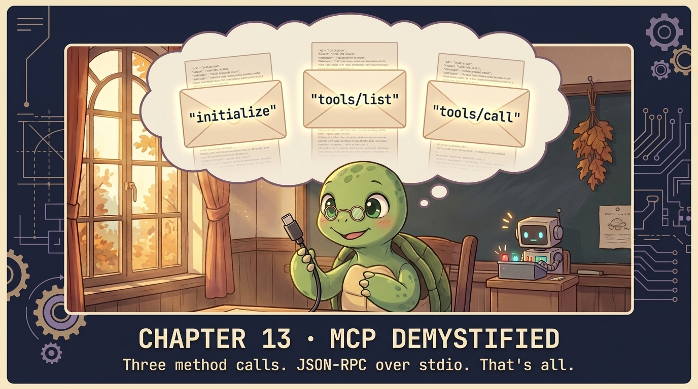

# Chapter 13 — MCP Demystified 🐢

<p align="center">
  
</p>

> **MCP is "USB-C for AI" if you're selling it. From the wire, it's three things: a child process, line-delimited JSON-RPC 2.0, three method calls.**

## 🐢 GuiGui says

When Anthropic announced MCP, half of dev Twitter said "this is huge" and the other half said "what is it actually." Both right. The marketing was a USB-C cable — but nobody told you what bytes flowed through. This chapter answers it. **Three method calls. That's the whole protocol.**

## The 3 method calls

```
client                                    server (child process)
  │                                          │
  ├── 1. initialize (handshake) ────────────▶│
  │◀─────── { capabilities, serverInfo } ───┤
  │── notifications/initialized ───────────▶│
  │                                          │
  ├── 2. tools/list ────────────────────────▶│
  │◀─────── { tools: [{name, description}] }─┤
  │                                          │
  ├── 3. tools/call (run one) ─────────────▶ │
  │◀─────── { content: [{type, text}] } ────┤
```

Line-delimited JSON-RPC over stdin/stdout. No SDK. No registry. Three calls. **That's MCP.**

## Show me the code

```python
import json, subprocess, sys

class MCPProcess:
    def __init__(self, cmd):
        self.proc = subprocess.Popen(cmd, stdin=subprocess.PIPE,
                                     stdout=subprocess.PIPE, text=True, bufsize=1)
        self.next_id = 1

    def call(self, method, params=None):
        req = {"jsonrpc": "2.0", "id": self.next_id, "method": method}
        if params: req["params"] = params
        self.next_id += 1
        self.proc.stdin.write(json.dumps(req) + "\n")
        self.proc.stdin.flush()
        # read response (skipping notifications)
        while True:
            msg = json.loads(self.proc.stdout.readline())
            if msg.get("id") == req["id"]:
                return msg.get("result")
```

50 lines including the close logic. **No SDK.** When you understand this, MCP stops being mysterious.

## ⚠️ Watch out for

**The orphan child process.** Forgetting to call `proc.terminate()` leaves zombie servers running. After 17 invocations your fan is at full speed. Always `try/finally close()`.

## ✅ Summary

- MCP = JSON-RPC 2.0 over stdin/stdout of a child process.
- Three calls: `initialize`, `tools/list`, `tools/call`.
- Tools come back as content blocks — same shape as Anthropic's response.

## 📝 Homework

```bash
python -m chapters.ch13_mcp_wire
```

1. Read every byte that flows in/out. Match each request to its response.
2. Wire `mcp_servers/calculator_server.py` into Claude Desktop. Restart. Ask it math.
3. Write a NEW MCP server — `weather_server.py` — in <100 lines. Connect via [ch14](ch14_mcp_agent.md).

## 📚 References

- [Model Context Protocol — specification](https://spec.modelcontextprotocol.io) — the canonical spec, ~30 pages
- [Anthropic — MCP launch post](https://www.anthropic.com/news/model-context-protocol) — the conceptual frame
- [JSON-RPC 2.0 specification](https://www.jsonrpc.org/specification) — the wire protocol MCP wraps
- [modelcontextprotocol/servers](https://github.com/modelcontextprotocol/servers) — reference servers (filesystem, GitHub, postgres, etc.)
- [Claude Desktop MCP setup](https://modelcontextprotocol.io/quickstart/user) — wire your custom server into the desktop app

## 🚀 Next

[Chapter 14 — MCP into the loop](ch14_mcp_agent.md): now wire it through the agent.
